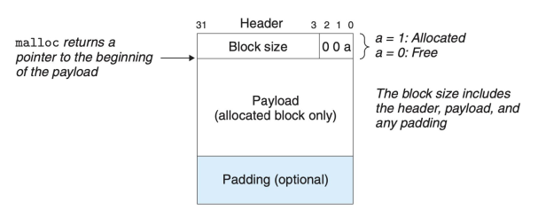
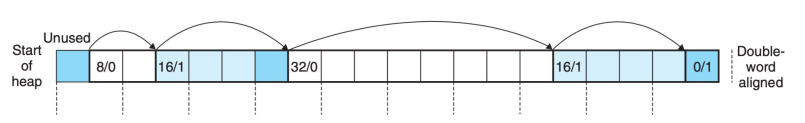
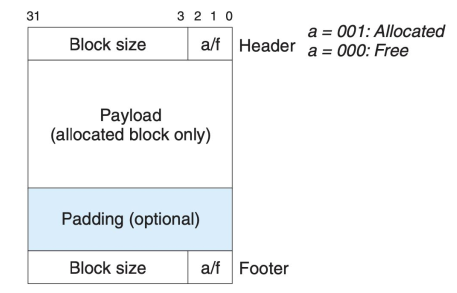
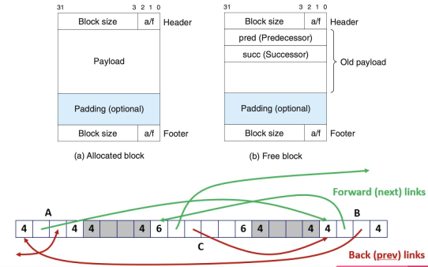

**Аллокаторы памяти** -специализированный класс, реализующий и инкапсулирующий малозначимые с прикладной точки зрения детали распределения и освобождения ресурсов компьютерной памяти.

Важно понимать:
* выделение происходит блоками (aka непрерывные куски виртуальной памяти)
* выделение происходит на куче (хотя если очень захотеть, то можно и на стеке)

В языке Си функции для выделения памяти - malloc, calloc, realloc, а также free для ее освобождения. Помимо этого существует функция mmap, которая позволяет отобразить кусок памяти в адресное пространство процесса. При этом "под капотом" этих функций происходят системные вызовы:
- при запросе памяти на куче - *sbrk*(_void* sbrk(intptr_t incr)_); соответственно происходит увеличение указателя на конец кучи (этот указатель - brk), на величину incr
- при отображении памяти - mmap() (соответственно, для освобождения - munmap())
На самом деле, если запросить выделение большого блока памяти с помощью malloc(), то вместо того, чтобы выделить память в куче, стандартная библиотека C задействует механизм анонимного отображения. 
Помимо выделения на куче в Си существует функция *alloca()*, которая позволяет выделять на стеке (понятно, что это крайне не рекомендуется делать даже согласно документации, но даже такое существует)

* [Ссылка на статью, где немного хаотично про функции выделения в Си](https://habr.com/ru/companies/otus/articles/889020/)
* [Ссылка на статью, где в основном про устройство адресного пространства, но проскакивает, возможно, полезная информация](https://habr.com/ru/companies/smart_soft/articles/185226/)

Итак, чем же плохи данные функции?
- выделение происходит без учета специфики хранимых данных (они просто выделяют определенный набор байт, хотя назначение и тип объектов, которые планируется хранить могут подсказать, как их эффективнее хранить с учетом их использования)
- обращение к ядру ОС через системный вызов (это просто долго)
- вызывают фрагментацию
- проблема утечки памяти
- проблема локальности ссылок (адреса, которые возвращает malloc могут быть в разных концах кучи, что будет приводить к промахам в кэшах)

Определим требования к нашему аллокатору, который мы хотим
+ произвольный набор allocate и free (то есть не существует закономерности, которая позволит нам сделать работу эффективне + будем считать, что освобождается только кусок, который был выделен (конечно, free() от блока нулевого размера ничего не сделает, поэтому можно по аналогии опустить этот пункт))
+ отсутствие буферизации (нельзя, например, ждать, когда рядом освободится место, чтобы блок выделенной памяти соответствовал запрашиваемой; иными словами - немедленный ответ на запрос)
+ выделяем на куче (потому что выделять на стеке - трэш)
+ блоки выровнены (чтобы можно было выделять данные произвольного типа - как правило по 8 байт)
+ нельзя изменять выделенные блоки (все манипуляции проводятся только со свободными блоками)

Соответственно, появляются 2 параметра, по которым можно оценивать аллокатор -  throughput и memory utilization. Что касается пропускной способности - число запросов в еденицу времени, которые аллокатор способен обрабатывать в единицу времени. Что касается использования памяти - неплохо было бы максимизировать размер полезной нагрузки (реально используемой памяти) относительно размера кучи

Пару слов о фрагментации: бывает внешняя и внутренняя. Внешняя формируется в процессе выделения/освобождения, когда оказывается, что формируется некоторое количество блоков памяти, которые не соответствуют запросам и долгое время пустуют. Внутренняя формируется в самом выделенном блоке - за счет выравнивания (как в случае со структурами в Си) или просто большому размеру минимального блока выделения

Теперь про сами реализации аллокаторов

## *Linear Allocator - линейный аллокатор*

Пожалуй, самый простой. Идея состоит в том, чтобы сохранить указатель на начало блока памяти выделенному аллокатору, а также использовать другой указатель или числовое представление, которое необходимо будет перемещать каждый раз, когда выделение из аллокатора завершено. В этом аллокаторе внутренняя фрагментация сведена к минимуму, потому что все элементы вставляются последовательно (пространственная локальность), и единственная фрагментация между ними — выравнивание. Тогда при запросе на выделение будет происходить проверка, достоточно ли памяти (иначе syscall), сохранение текущего указателя (чтобы дать пользователю) и смещение указателя. Что касется освобождения, то освобождение происходит только всей памяти, выделенной аллокатором. 

Итого, получаем очень быстрый аллокатор с малой фрагментацией (только за счет внутренней), но ужасным переиспользованием памяти (можно долго ждать освобождения блока в начале, который долгое время назад можно было бы освободить)

## Stack Allocator - стековый аллокатор 

Работает по принципу стека. Умная эволюция линейного распределителя, которая позволяет управлять памятью, как стеком. Все так же, как и раньше, мы сохраняем указатель вместе с «header» блоком (в дальнейшем будет употребляться, как **заголовок**) на текущий адрес памяти и перемещаем его вперед для каждого выделения. В отличие от линейного аллокатора, мы также можем переместить его назад, то есть выполнить операцию deallocate, которая линейным аллокатором не поддерживается. Как и прежде, сохраняется принцип пространственной локальности, а фрагментация все еще минимальная.

То есть, теперь мы храним в начале выделенного блока информацию о размере этого блока. В остальном работаем также, как и с линейным аллокатором - имеется указатель на конец кучи, соответственно при выделении блока памяти выделяется чуть больше (но пользователю возвращается указатель сразу на блок памяти сразу за метаданными!). С осовождением действует принцип LIFO. То есть от указанного пользователем указателя отнимается размер заголовка, а затем перемещается конец стека на соответствующий указатель. Если же мы попробуем очистить блок где-то внутри кучи, то мы затрем все последующие данные.
Итого, мы сохранили все плюсы линейного аллокатора, плюс добавили чуть более эффективное удаление.

Существует еще пример с двухторонном стеком (из названия, думаю, понятно, что он делает и как работает)
## Poll Allocator - блочный аллокатор

Идея блочного аллокатора заключается в том, что он разделяет некоторый большой участок памяти на более мелкие участки **одинакового размера**. По своей сути он также является очень простым аллокатором, так как, когда запрашивается выделение, он просто возвращает один из свободных участков памяти фиксированного размера, а когда запрашивается освобождение то, он просто сохраняет этот участок памяти для дальнейшего использования. Таким образом, распределение работает очень быстро, а фрагментация все еще очень мала.
При этом мы явно храним список свободных блоков. При выделении мы удаляем блок из числа свободных, а при удалении - добавляем в этот список (в зависимоти от стратегии - в начало/конец). 
Соответственно, выделение работает достаточно быстро - мы просто берем первый адрес (из стека/очереди), также как и удаление. Фрагментация отсутвует вообще (фиксированный размер блока подбирается под задачу, а сами блоки выделяются без промежутков, плюс достаточно быстро заполняются, в зависимости от стратегии, новыми), и мы не храним метаданные/не проводим арифметику над указателями. Но цена этого - просто специфика использования (из самых известных применений - в PlayStation/Xbox; используется в играх)

[Сслылка на статейку по этим почему-то "альтернативным" аллокаторам](https://habr.com/ru/articles/274827/)

## Imlicit Free List - неявный список

Для этого аллокатора будем также использовать метаданные. Будем (например) хранить в первых 60 битах блока информацию о размере блока, а последних 4 - бит занятости (плюс немного буфера для безопасности; ну или еще какую-нибудь метаинформацию). Тогда, получается, что мы можем перейти от данного блока к следующему за ним за счет прибавления его размера и заголовка - вот и неявный лист! 
Тогда, для того, чтобы выделить блок памяти, мы должны выбрать стратегию размещения:
+ first fit - будем брать первый, который окажется достаточным по размеру; быстрый, но скорее всего, чтобывыделить большой блок придется идти в самый конец + в зависимости от политики поведения с остатками можно сильно фрагментировать память
+ next fit - будем брать первый подходящий , который идет после последнего выделенного; может работать быстрее first fit, но в целом похож на него
+ best fit - будем искать наиболее подходящий по размерам блок; лучше всего по использованию памяти, но придется идти по всей куче
Выделяя блок, мы можем поступить 2 путями - взять весь, вне зависимости от того, сколько места останется (фрагментация внутренняя), или выделить только нужный размер, а остальное оставить как незаполненный блок, добавив заголовок и пометив его свободным (фрагментация внешняя). 
Но, может оказаться, что рядом лежат 2 свободных блока; тогда при попытке выделить блок, который меньше, чем их сумма, но больше каждого поотдельности, аллокатор пропустит этот кусок - это ведет к фрагментации. Значит нужно научиться объединять свободные блоки. 
+ наивный способ - запустить проход по куче с первого блока и проверять для каждого свободного блока, нет ли за ним еще одного свободного. Если есть - изменяем размер первого (данные в заголовке). Основные проблемы - нужно еще раз идти по всей куче и непонятно, когда этот проход запускать. 
+ метод граничных маркеров - добавим информацию из заголовка в конец блока; тогда следующему блоку будет доступен статус своего соседа слева. Логично, что пытаться искать блоки для объединения имеет смысл только после освобождения, при чем только от освобожденного. Но блок имеет возможность смотреть на своих соседей - тогда, если они свободны, то просто меняем информацию в соответсвующих заголовках (наверное несложно понять, что случая всего 4)
Итого, можно выделять память за линейное время и удалять за константное, причем достаточно хорошая борьба с фрагментацией

## Explicit Free List - явный список

Структура блока остается такой же, как и для предыдущего аллокатора, но добавим после header две ссылки - на следующий свободный блок и на предыдущий. Это позволит ускорить процесс хождения по куче - будем пропускать уже выделенные (явно неподходящие) блоки. Тогда при нахождении подходящего останется только поменять ссылки. При этом в остальном работает также, как и IFL (в плане объединения, освобождения). Могут быть разные политики вставки освободившихся блоков - можно упорядочивать по адресам, можно LIFO

## Segregated Free List - список блоков

Будем хранить массив списков со свободными блоками определенного диапазона (какого? можно удобно подогнать под блоки, которые потребуются под задачу, можно по степени двойки и прочее)
Выделение будет таким: идем в список с нужным диапазоном и смотрим, есть ли там подходящий; если есть - удаляем блок, остаток перемещаем в соответствующий список; если нет - идем в "старший" список и берем оттуда блок и проделываем тоже самое, Освобождение - простое добавление в соответствующий список + если очень захотеть, то можно добавить объединение блоков с перемещением по списку (сомнительно, но может быть полезно).
Реализации:
+  Simple Segregated Storage - списки хранят не блоки из диапазона размеров, а конретный размер. При выделении берем первый; если нет - запрашиваем у ОС память и дробим на соответствующие блоки. При удалении добавляем в начало. Объединения нет. Итого - константное время на выделение/освобождение, но жуть-жуткая с фрагментацией
+ Segregated Fits - в списке будем хранить IFL или EFL. При добавлении - по политике first fit,  ровно как общая концепция (с поиском в старших классах, остатками(делением)б объединением и отправкой в нужный список). Итого - поиск по части кучи соответствующего размера.

## Полезные ссылки
[Неплохое объяснение на примерах](https://habr.com/ru/articles/505632/)
[Неплохая статья с кодом на  C++](https://habr.com/ru/articles/590415/)

[презентация](DMA.pdf)
